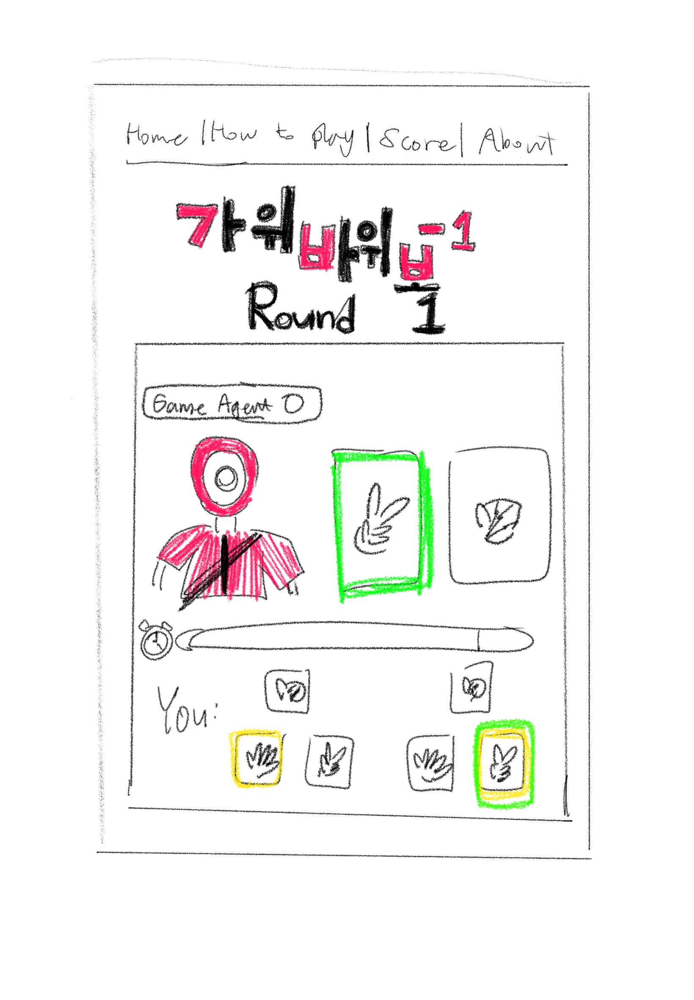
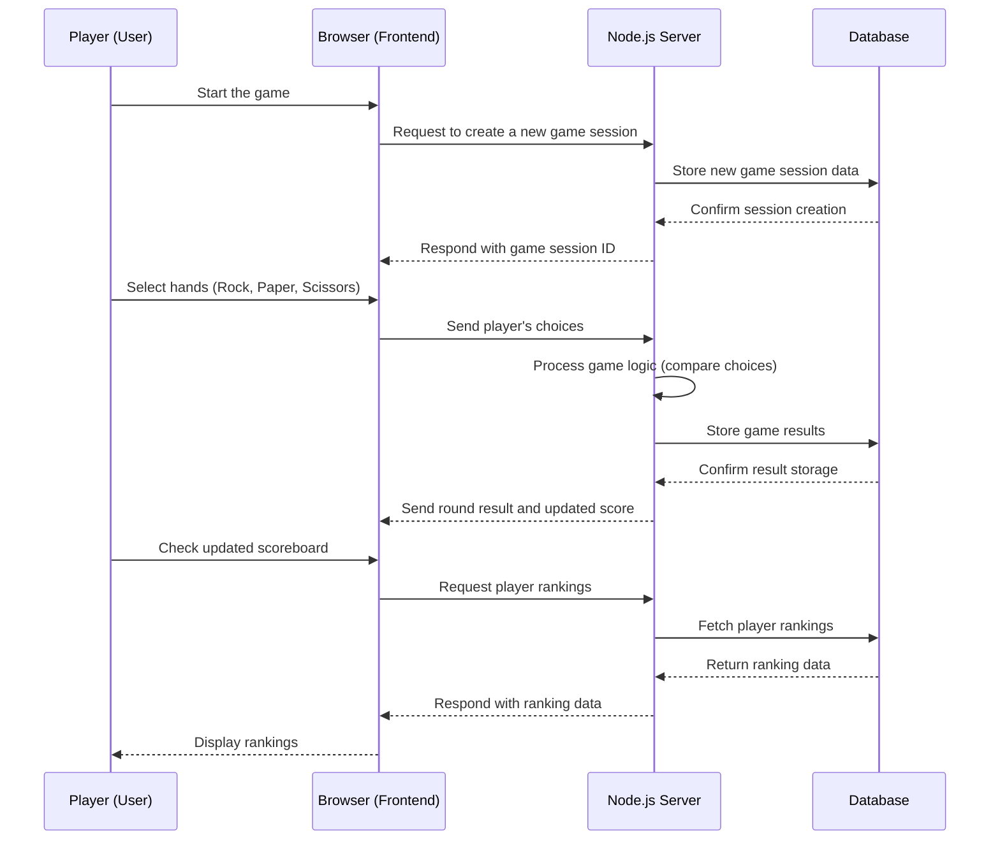

### This repository has been created on Jan-13-2025

# Rock, Paper, Scissors, Minus One Game

[My Notes](notes.md)

This application provides the functionality to play a game called ***Rock-Paper-Scissors One-Out***, which is popular in Korea. It will include features to post game results and share the game with friends.

## 🚀 Specification Deliverable

For this deliverable, I did the following. I checked the box `[x]` and added a description for things I completed.

- [x] Proper use of Markdown
- [x] A concise and compelling elevator pitch
- [x] Description of key features
- [x] Description of how you will use each technology
- [x] One or more rough sketches of your application. Images must be embedded in this file using Markdown image references.

### Elevator pitch

Have you heard of 'Rock-Paper-Scissors, Minus One'? This is a unique twist on the traditional game, rock-paper-scissors, made famous by the global Netflix hit 'Squid Game'. Now, you will face off against characters from Squid Game in intense, strategic battles. Victory will earn you a place in the 'Hall of Fame,' where your achievements will be remembered forever. Winners also gain the exclusive privilege of inviting their friends to join this extraordinary challenge. A thrilling game where a simple choice can lead to ultimate glory—dare to play now!

### Design

### Key features

- log-in with user ID and password
- Instruction about how to play
- Start a game session and play with buttons
- Real-time play with the programmed game-partner
- Results display
- Hall of Fame with scores from users' plays
- Ability to share game invitations to friends

### Technologies

I am going to use the required technologies in the following ways.

- **HTML** - Defines the basic structure of the web application. It will be used to design the layout of the home-login screen, game screen inclduing buttons, result screen, how-to-play screen, about screen, and scoreboards.
- **CSS** - Specifies the style of the game screen. It enhances user experience by applying button colors, layouts, animations, and responsive design.
- **React** - React will manage each part of the game with a component-based structure. It dynamically handles user selections, game states, and scoreboard updates.
- **JavaScript** - Implements the functionality of the game. It calculates results based on user input and updates the game state accordingly.
- **Node.js** - Manages the backend server and handles data processing for the game. It stores user scores and records or calculates game results.
- **Service** - Backend service with endpoints for:
    - Login with Auth0 authentification API
    - Creating game sessions
    - Submitting player choices
    - Retrieving game scores
    - Generating invite links
- **DB/Login** - Stores and manages user-ID, game records, and user scores. This ensures the persistence of win points and ranking data.
- **WebSocket** - Ensures real-time updates for player actions and results.

## 🚀 AWS deliverable

For this deliverable, I did the following. I checked the box `[x]` and added a description for things I completed.

- [x] **Server deployed and accessible with custom domain name** - [My server link]([(http://rockpaperscissorsminusone.link/)]) 

## 🚀 HTML deliverable

For this deliverable I did the following. I checked the box `[x]` and added a description for things I completed.

- [ ] **HTML pages** - I did not complete this part of the deliverable.
- [ ] **Proper HTML element usage** - I did not complete this part of the deliverable.
- [ ] **Links** - I did not complete this part of the deliverable.
- [ ] **Text** - I did not complete this part of the deliverable.
- [ ] **3rd party API placeholder** - I did not complete this part of the deliverable.
- [ ] **Images** - I did not complete this part of the deliverable.
- [ ] **Login placeholder** - I did not complete this part of the deliverable.
- [ ] **DB data placeholder** - I did not complete this part of the deliverable.
- [ ] **WebSocket placeholder** - I did not complete this part of the deliverable.

## 🚀 CSS deliverable

For this deliverable I did the following. I checked the box `[x]` and added a description for things I completed.

- [ ] **Header, footer, and main content body** - I did not complete this part of the deliverable.
- [ ] **Navigation elements** - I did not complete this part of the deliverable.
- [ ] **Responsive to window resizing** - I did not complete this part of the deliverable.
- [ ] **Application elements** - I did not complete this part of the deliverable.
- [ ] **Application text content** - I did not complete this part of the deliverable.
- [ ] **Application images** - I did not complete this part of the deliverable.

## 🚀 React part 1: Routing deliverable

For this deliverable I did the following. I checked the box `[x]` and added a description for things I completed.

- [ ] **Bundled using Vite** - I did not complete this part of the deliverable.
- [ ] **Components** - I did not complete this part of the deliverable.
- [ ] **Router** - Routing between login and voting components.

## 🚀 React part 2: Reactivity

For this deliverable I did the following. I checked the box `[x]` and added a description for things I completed.

- [ ] **All functionality implemented or mocked out** - I did not complete this part of the deliverable.
- [ ] **Hooks** - I did not complete this part of the deliverable.

## 🚀 Service deliverable

For this deliverable I did the following. I checked the box `[x]` and added a description for things I completed.

- [ ] **Node.js/Express HTTP service** - I did not complete this part of the deliverable.
- [ ] **Static middleware for frontend** - I did not complete this part of the deliverable.
- [ ] **Calls to third party endpoints** - I did not complete this part of the deliverable.
- [ ] **Backend service endpoints** - I did not complete this part of the deliverable.
- [ ] **Frontend calls service endpoints** - I did not complete this part of the deliverable.

## 🚀 DB/Login deliverable

For this deliverable I did the following. I checked the box `[x]` and added a description for things I completed.

- [ ] **User registration** - I did not complete this part of the deliverable.
- [ ] **User login and logout** - I did not complete this part of the deliverable.
- [ ] **Stores data in MongoDB** - I did not complete this part of the deliverable.
- [ ] **Stores credentials in MongoDB** - I did not complete this part of the deliverable.
- [ ] **Restricts functionality based on authentication** - I did not complete this part of the deliverable.

## 🚀 WebSocket deliverable

For this deliverable I did the following. I checked the box `[x]` and added a description for things I completed.

- [ ] **Backend listens for WebSocket connection** - I did not complete this part of the deliverable.
- [ ] **Frontend makes WebSocket connection** - I did not complete this part of the deliverable.
- [ ] **Data sent over WebSocket connection** - I did not complete this part of the deliverable.
- [ ] **WebSocket data displayed** - I did not complete this part of the deliverable.
- [ ] **Application is fully functional** - I did not complete this part of the deliverable.
