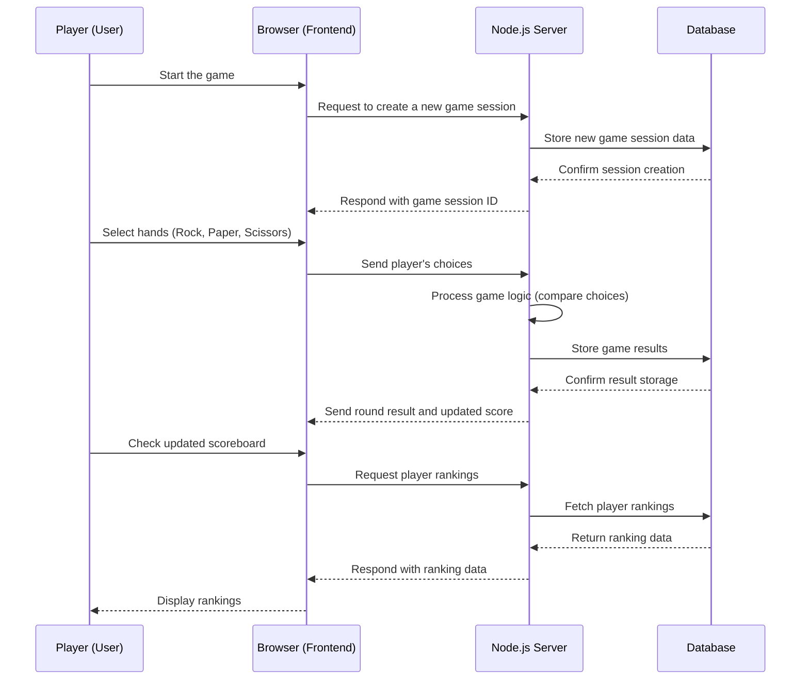

### This repository has been created on Jan-13-2025

# Rock, Paper, Scissors, Minus One Game

[My Notes](notes.md)

This application provides the functionality to play a game called ***Rock-Paper-Scissors One-Out***, which is popular in Korea. It will include features to post game results and share the game with friends.

## 🚀 Specification Deliverable

For this deliverable, I did the following. I checked the box `[x]` and added a description for things I completed.

- [x] Proper use of Markdown
- [x] A concise and compelling elevator pitch
- [x] Description of key features
- [x] Description of how you will use each technology
- [x] One or more rough sketches of your application. Images must be embedded in this file using Markdown image references.

### Elevator pitch

Have you heard of 'Rock-Paper-Scissors, Minus One'? This is a unique twist on the traditional game, rock-paper-scissors, made famous by the global Netflix hit 'Squid Game'. Now, you will face off against characters from Squid Game in intense, strategic battles. Victory will earn you a place in the 'Hall of Fame,' where your achievements will be remembered forever. Winners also gain the exclusive privilege of inviting their friends to join this extraordinary challenge. A thrilling game where a simple choice can lead to ultimate glory—dare to play now!

### Design

### Key features

- log-in with user ID and password
- Instruction about how to play
- Start a game session and play with buttons
- Real-time play with the programmed game-partner
- Results display
- Hall of Fame with scores from users' plays
- Ability to send game invitations to friends

### Technologies

I am going to use the required technologies in the following ways.

- **HTML** - Defines the basic structure of the web application. It will be used to design the layout of the home-login screen, game screen inclduing buttons, result screen, how-to-play screen, about screen, and scoreboards.
- **CSS** - Specifies the style of the game screen. It enhances user experience by applying button colors, layouts, animations, and responsive design.
- **React** - React will manage each part of the game with a component-based structure. It dynamically handles user selections, game states, and scoreboard updates.
- **JavaScript** - Implements the functionality of the game. It calculates results based on user input and updates the game state accordingly.
- **Node.js** - Manages the backend server and handles data processing for the game. It stores user scores and records or calculates game results.
- **Service** - Backend service with endpoints for:
    - Login with Auth0 authentification API
    - Creating game sessions
    - Submitting player choices
    - Retrieving game scores
    - Generating invite links
- **DB/Login** - Stores and manages user-ID, game records, and user scores. This ensures the persistence of win points and ranking data.
- **WebSocket** - Ensures real-time updates for player actions and results.

## 🚀 AWS deliverable

For this deliverable, I did the following. I checked the box `[x]` and added a description for things I completed.

- [x] **Server deployed and accessible with custom domain name** - [My server link](https://rockpaperscissorsminusone.link/) 

## 🚀 HTML deliverable

For this deliverable, I did the following. I checked the box `[x]` and added a description for things I completed.

| **index.html**                       | **how.html**                        | **play.html**                       |
|--------------------------------------|-------------------------------------|-------------------------------------|
|  |  |  |

| **halloffame.html**                  | **about.html**                      | **invite.html**                     |
|--------------------------------------|-------------------------------------|-------------------------------------|
|  |  |  |

- [x] **HTML pages** - I added 6 HTML pages: (1) index.html - homepage, (2) how.html - Instructions about how to play the game, (3)    play.html - actual page for playing the game, (4) halloffame.html - displays players' scores, (5) about.html - includes a brief explanation about the game and the origin, game maker's message, and (6) invite.html - page that winners can send an invitation to their friends
- [x] **Proper HTML element usage** - I hope I used them correctly.
- [x] **Links** - Most HTML pages are connected to the Nav section. Only invite.html can be accessed from play.html because invite.html is only for the winners of the game.
- [x] **Text** - I included some textual content to describe how my application will work.
- [x] **3rd party API placeholder** - I need a login authentification API and email sending API. Login API on index.html with login features and email sending API on invite.html with the "send invitation" button.
- [x] **Images** - I included some pictures.
- [x] **Login placeholder** - index.html includes login placeholder. Login authentication API will also be used.
- [x] **DB data placeholder** - The Hall of Fame will display the DB data of players' scores(how many times they beat the frontman and how many times the winners' friends accept the invitations)
- [x] **WebSocket placeholder** - The game requires real-time communication with the server as the player's and server's random-oriented decisions need to be compared for the game result. In addition, the timer needs real-time communications with the server as well, and the invite button and the hall of fame button on play.html should be only accessible to the winners. The send invitation button on invite.html should be disabled after the winner sends one invitation.

## 🚀 CSS deliverable

For this deliverable, I did the following. I checked the box `[x]` and added a description for things I completed.

- [x] **Header, footer, and main content body** - used CSS for header, footer, and main content body.
- [x] **Navigation elements** - used CSS for navigation elements.
- [x] **Responsive to window resizing** - used CSS for responsive window resizing.
- [x] **Application elements** - used CSS for some tables on the application.
- [x] **Application text content** - used CSS for text content.
- [x] **Application images** - used CSS for image style.

## 🚀 React part 1: Routing deliverable

For this deliverable, I did the following. I checked the box `[x]` and added a description for things I completed.

- [x] **Bundled using Vite** - Completed.
- [x] **Components** - Completed.
- [x] **Router** - Completed.

+ Updated favicon!
+ Modified responsive resizing feature as the laptop-size monitors did not show the header and footer.
+ Modified the size of the logo as it was too big.

## 🚀 React part 2: Reactivity

For this deliverable, I did the following. I checked the box `[x]` and added a description for things I completed.

- [x] **All functionality implemented or mocked out**
- [x] **Hooks**

## 🚀 Service deliverable

For this deliverable, I did the following. I checked the box `[x]` and added a description for things I completed.
    
- [x] **Node.js/Express HTTP service** 
- [x] **Static middleware for frontend** 
- [x] **Calls to third party endpoints** 
- [x] **Backend service endpoints** 
- [x] **Frontend calls service endpoints** 
- [x] **Supports registration, login, logout, and restricted endpoint**

Supports user account creation, login, and authentication as Simon does.
Integrated **Gmail sending API** with **Nodemailer** to send an invitation so that winners can invite their friends.
Hall of Fame Rankings are processed as Simon does.
Deployment was soooo confusing. As .env is not recommended to be uploaded online, to deal with environmental parameters, I added the parameters on AWS as secure strings with Parameter Store after adding IAM role to my instance.

## To test Gmail API, I changed some logic because you need to defeat the frontman in order to go to the invite page. Just choose rocks as the agents will always choose scissors. After you defeat the frontman, go to the invite page, and type any name and your email address. I used my Gmail account to send an email as the API requires higher security policies. I limited the number of times that emails can be sent within 5 minutes, which is 10.

## 🚀 DB/Login deliverable

For this deliverable, I did the following. I checked the box `[x]` and added a description for things I completed.

- [ ] **Stores data in MongoDB** - I did not complete this part of the deliverable.
- [ ] **Stores credentials in MongoDB** - I did not complete this part of the deliverable.

## 🚀 WebSocket deliverable

For this deliverable, I did the following. I checked the box `[x]` and added a description for things I completed.

- [ ] **Backend listens for WebSocket connection** - I did not complete this part of the deliverable.
- [ ] **Frontend makes WebSocket connection** - I did not complete this part of the deliverable.
- [ ] **Data sent over WebSocket connection** - I did not complete this part of the deliverable.
- [ ] **WebSocket data displayed** - I did not complete this part of the deliverable.
- [ ] **Application is fully functional** - I did not complete this part of the deliverable.
